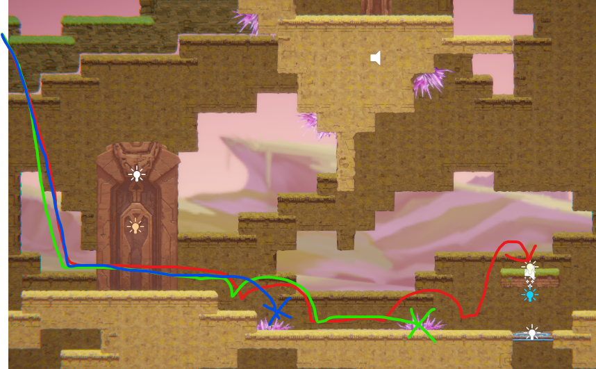

# COMP2150  - Level Design Document
### Name: Matthew Ho
### Student number: 47729686 

## 1. Player Experience
### 1.1. Discovery
Throughout the level, the player unlocks new areas through exploration and new abilities. On a first playthrough of a section, the player may note areas that are not accessible to them and after unlocking the associated abilities (that allow them to 'unlock' previously locked spaces which will reward the player as well as being able to immediately test and experiment with what they have been given to reinforce how the ability can be used. This follows good design practice as the level is not overloaded with difficult platforming and has isolated elements that teach the player how to move through and interact with the level in a safe environment before challenging them with harder elements. E.g. section 1 introduces the basics that are used in the rest of the sections (spikes, moving platforms, and acid). The isolated elements that allow the player to learn what they can do is shown below:

### 1.2. Drama
The intensity of the level is designed to get harder as the player transitions between sections. Yet, the player is given movements of relief during the connective spaces between sections which allows the player to 'cool' down before attempting the next challenge. Tension is built within the level through the scarcity of checkpoints between challenging parts or to reduce frustration which doesn't help contribute to building the tension of the level, rather it detracts from the experience that the level is providing.

### 1.3. Challenge
What are the main challenges? How have you designed and balanced these challenges to control the difficulty curve and keep the player in the flow channel?
In the level, the player is introduced to more challenging platforming scenarios within each section of increasing difficulty. Within section 1, the player is able to freely test and experiment with the moving platform mechanics before they reach section 2 where their abilities are tested (mainly the ascending platform where the player must move around to avoid taking damage from the spikes). This culminates in section 3 where the player's abilities and experience is tested and the player must put what they've learned into practice by moving around a moving platform and avoiding damage from the enemies or by falling into the pit of acid.

### 1.4. Exploration
To facilitate exploration in my level design, the level was built around the style of the metroidvania genre. This means that the player must backtrack through section 1 of the level with their new abilities to unlock the next section. Autonomy is given to the player as there are multiple ways to get to the destination they have set. For example, after completing section 2 and receiving the staff weapon, they are able to break the destructible walls and unlock new paths such as the space with the key. They can then either backtrack through the way that they came, or can use the shortcut (with enemies) to make moving through the level easier and not annoying. This is shown in the following image:

## 2. Core Gameplay
### 2.1. Spikes

Spikes were introduced here early in the level in an isolated environment to tell the player that they should not touch it. They are introduced to this by restricting the player from just holding right to get past. This is further reinforced in section 2 where the player must avoid spikes on the wall during their ascent upwards. (Shown below:)

### 2.2. Moving Platforms
Firstly, the player is introduced to the moving platform in a safe environment (they cannot die from experimenting only from hitting the spike located to the left of the platform). The platform stays stationary until stepped on so the player can understand the intricacies (for the platform to not move before being stepped on, there is an invisible button where the player cannot pass through from the bottom). Later, in section 2, the player must learn how to move on the platform while it is moving to avoid touching the spikes and taking damage.

### 2.3. Acid
Acid's purpose is demonstrated if the player misses the moving platform. After getting off the platform and the player is still curious, there is a checkpoint nearby that they can activate so that their progress won't reset after experimenting with the acid pit. (this is shown in 2.4. Checkpoints).

### 2.4. Checkpoints
Checkpoints are introduced after the acid pit to prevent the player from being forced to complete section 1 of the level again if they were to die in section 2.

### 2.5. Passthrough Platforms
The passthrough platforms are introduced in a safe environment so the player can experiment and test all combinations to get past the obstacle without dying.

### 2.6. Chompers
Chompers are first introduced to the player when they don't have a weapon, this forces them to understand how to evade their movements.

### 2.7. Weapon Pickup (Staff)
After the staff is picked up, the player can experiment on the breakable wall or to try and attack the chomper (by jumping and attacking at the same time). With the chomper on the mini ledge, there is no risk of the player taking damage when swinging.

### 2.8. Health Pickups
After completing section 2 and dealing with all the enemies, the player can regain a bit of health, or choose to grab the key and move onto the next section.

### 2.9. Spitters
The spitters are introduced here where there is no other obstacles in the way so that they can understand their attack pattern before killing it. If the player kills it before it is able to showcase its attack pattern, the spitter in section 3 is isolated and can be killed with the gun ability.

### 2.10. Keys
Keys are introduced after completing section 2 as a reward for completing the platforming/killing the enemies in the way.

### 2.11. Weapon Pickup (Gun)
The gun is picked up before dealing with the moving platforms of section 3 and must be used in the section to grab the next key. The entirety of section 3 showcases the abilities (killing enemies or toggling switches) which is used to grab the 3rd key in section 1 which is locked behind a togglable switch.

## 3. Spatiotemporal Design
### 3.1. Molecule Diagram

### 3.2. Level Map – Section 1

### 3.3.	Level Map – Section 2

### 3.4.	Level Map – Section 3

## 4. Iterative Design
After completing the final design of the level, there are many elements changed between the initial design for the level and the finished version. For example, in the paper prototype for section 1 (as shown below) gameplay elements were introduced too fast for the player to understand what each specific element did and required a restructuring of the entire section as the level may have been too difficult.  

Additionally, sections 2 and 3 required tweaking after playtesting some portions of the level felt unfair to the player such as the spike hitbox being too strict and damaging the player without them noticing as the spike's default hitbox included all of the spike which is hard to see. This was improved by tweaking the hitbox size to only include the main spike portion so the level is more forgiving. Another example of iterative design is when one of the enemies would target the player from offscreen and potentially knock them off the platform and lose a chunk of progress. This was then altered into a spot that is visible to the player while still maintaining the difficulty for the portion of the level (seen in the level map for section 3, near the 2nd moving platform). 
An issue found within section 3 is the method the player takes to make their way back to section 1 (where the end level door is located) where the player may have become lost after receiving the 2nd key. This was then improved through modifying the background tilemap to show arrow for the player to follow which provided a shortcut rather than requiring the player to backtrack through the completed platforming section where a fall into the pit of acid required the player to finish the platforming section and pick up the key again to then potentially fall back into the acid pool while backtracking.
For future improvements to the level design, portions of the level may benefit from negative space to increase the difficulty of the level as well as fit the theme of the level (exploring a cave) or more puzzle elements using the player's abilities to emphasise how the ability can be used or to provide additional ways to use them.

## Generative AI Use Acknowledgement

### Tool Used: None
**Nature of Use** 
**Evidence Attached?** 

**Additional Notes:**

